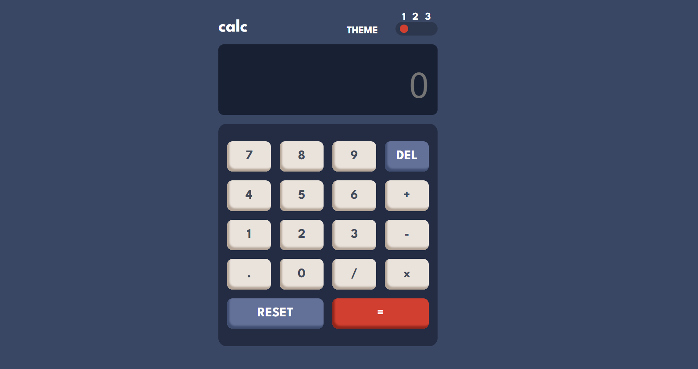

# Frontend Mentor - Calculator app solution

This is a solution to the [Calculator app challenge on Frontend Mentor](https://www.frontendmentor.io/challenges/calculator-app-9lteq5N29). Frontend Mentor challenges help you improve your coding skills by building realistic projects.

## Table of contents

- [Overview](#overview)
  - [The challenge](#the-challenge)
  - [Screenshot](#screenshot)
  - [Links](#links)
- [My process](#my-process)
  - [Built with](#built-with)
  - [What I learned](#what-i-learned)
  - [Continued development](#continued-development)
  - [Useful resources](#useful-resources)
- [Author](#author)
- [Acknowledgments](#acknowledgments)

**Note: Delete this note and update the table of contents based on what sections you keep.**

## Overview

### The challenge

Users should be able to:

- See the size of the elements adjust based on their device's screen size
- Perform mathmatical operations like addition, subtraction, multiplication, and division
- Adjust the color theme based on their preference
- **Bonus**: Have their initial theme preference checked using `prefers-color-scheme` and have any additional changes saved in the browser

### Screenshot



### Links

- Solution URL: [Add solution URL here](https://github.com/misecond4747/calculator-app.git)
- Live Site URL: [Add live site URL here](https://your-live-site-url.com)

## My process

### Built with

- Semantic HTML5 markup
- CSS custom properties
- Flexbox
- CSS Grid
- [Next.js](https://nextjs.org/) - React framework

### What I learned

I got to learn how to add themes and some js functions.

```html
<h1>I am proud of all.</h1>
```

```css
/* Default Theme (Theme 1) */
.theme1 {
  /* ### Theme 1 */

  /* #### Backgrounds */
  --main-background: hsl(222, 26%, 31%);
  --toggle-keyboard-background: hsl(223, 31%, 20%);
  --screen-background: hsl(224, 36%, 15%);

  /* #### Keys */
  --key-background: hsl(225, 21%, 49%);
  --key-shadow: hsl(224, 28%, 35%);
  --Red-key-background: hsl(6, 63%, 50%);
  --Dark-red-key-shadow: hsl(6, 70%, 34%);
  --grayish-orange-key-background: hsl(30, 25%, 89%);
  --Grayish-orange-key-shadow: hsl(28, 16%, 65%);

  /* #### Text */
  --primary-text-color: hsl(221, 14%, 31%);
  --secondary-text-color: hsl(0, 0%, 100%);
  --White: hsl(0, 0%, 100%);
}

/* Theme 2 */
.theme2 {
  /* ### Theme 2 */

  /* #### Backgrounds */
  --main-background: hsl(0, 0%, 90%);
  --toggle-keyboard-background: hsl(0, 5%, 81%);
  --screen-background: hsl(0, 0%, 93%);

  /* #### Keys */
  --key-background: hsl(185, 42%, 37%);
  --key-shadow: hsl(185, 58%, 25%);
  --Red-key-background: hsl(25, 98%, 40%);
  --Dark-red-key-shadow: hsl(25, 99%, 27%);
  --grayish-orange-key-background: hsl(45, 7%, 89%);
  --Grayish-orange-key-shadow: hsl(35, 11%, 61%);

  /* #### Text */
  --primary-text-color: hsl(60, 10%, 19%);
  --secondary-text-color: hsl(60, 10%, 19%);
  --White: hsl(0, 0%, 100%);
}

/* Theme 3 */
.theme3 {
  /* ### Theme 3 */

  /* #### Backgrounds */
  --main-background: hsl(268, 75%, 9%);
  --toggle-keyboard-background: hsl(268, 71%, 12%);
  --screen-background: hsl(268, 71%, 12%);

  /* #### Keys */
  --key-background: hsl(281, 89%, 26%);
  --key-shadow: hsl(285, 91%, 52%);
  --Red-key-background: hsl(176, 100%, 44%);
  --Dark-red-key-shadow: hsl(177, 92%, 70%);
  --grayish-orange-key-background: hsl(268, 47%, 21%);
  --Grayish-orange-key-shadow: hsl(290, 70%, 36%);

  /* #### Text */
  --primary-text-color: hsl(52, 100%, 62%);
  --secondary-text-color: hsl(52, 100%, 62%);
  --White: hsl(0, 0%, 100%);
}
```

```js
const formatValue = (value: string | number): string => {
  // Handle empty string and invalid values
  if (value === "") return "";

  // Convert the input value to a string (in case it's a number)
  const valueStr = value.toString();

  // If the value contains only a decimal point, return it as is
  if (valueStr === "." || valueStr.endsWith(".")) {
    return valueStr; // Allow partial input like "5." or "."
  }

  // Format valid numbers
  const formattedValue = new Intl.NumberFormat("en-US", {
    maximumFractionDigits: 10, // Adjust as needed
  }).format(Number(valueStr));

  return formattedValue;
};
```

### Continued development

I want to focus more on Javascript. I can work with javascript at a beginner level but i want to master it

### Useful resources

- [Chatgpt](https://www.example.com) - Chatgpt is one of the plateforms that helps baby coders. I got some tips and modifications from chatgpt.

## Author

- Frontend Mentor - [@misecond4747](https://www.frontendmentor.io/profile/misecond4747)

## Acknowledgments

If you are stuck at any point. Try it yourself to solve this problem. Like that you can improve your understanding about coding. While i was creating this project i got stuck at the functionality of the keys. I try to get help from chatgpt but it was a waste of time. I break the problem into little blocks so it is easier to understand and solve it.
